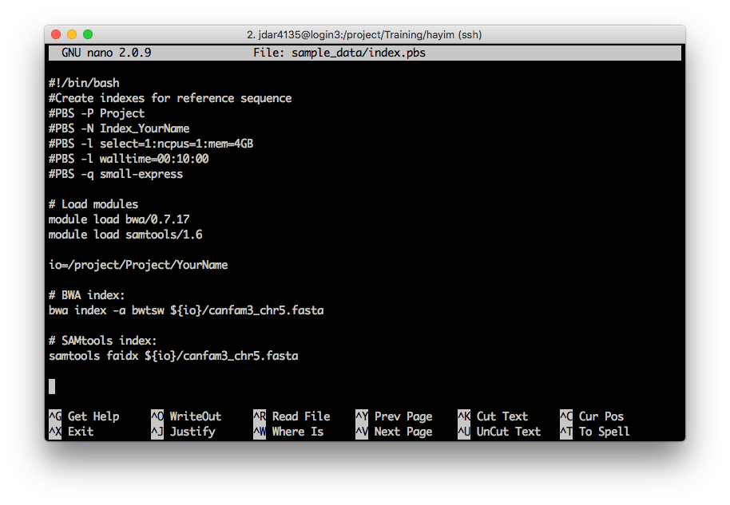

<div class="questions">  
### Questions

- What other use cases are ther for HPC?
- Can you run any software?
</div>  

<div class="objectives">  
### Objectives

- Run a Bioinformatics case study example

</div>  


# CASE STUDY - BIOINFORMATICS PIPELINE

## Index a genome

Open **index.pbs** and make any edits necessary. What will you need to change?

```
nano index.pbs
```

 


When you're done, save the script (on nano <kbd>Ctrl</kbd>+<kbd>o</kbd>), and exit (on nano <kbd>Ctrl</kbd>+<kbd>x</kbd>).

Submit the job as before, with ```qsub```:

```sh
qsub index.pbs
```


```sh
[jdar4135@login3 hayim]$ qsub index.pbs
2557043.pbsserver
```


This time I'm going to check on the job using ```qstat -wTu jdar4135``` to show my jobs, in wide format, with a start time estimate -- it's a little wide for this broswer window!

```sh
[jdar4135@login3 hayim]$ qstat -wTu jdar4135

pbsserver:
                                                                                  Est
                                                                                                   Req'd  Req'd   Start
Job ID                         Username        Queue           Jobname         SessID   NDS  TSK   Memory Time  S Time
------------------------------ --------------- --------------- --------------- -------- ---- ----- ------ ----- - -----
2557043.pbsserver              jdar4135        small-express   Index_hayim        49847    1     1    4gb 00:10 R --
```


When your job finishes (how will you know?) have a look at any log files produced. What is one way to check if there were any errors?

#### Answer
Search for Exit Status messages with ```grep```:

```sh
grep -se "Exit Status" *
```


```sh
[jdar4135@login3 hayim]$ grep -se "Exit Status" *
Index_hayim.o2557008_usage:Exit Status: 0
Index_hayim.o2557043_usage:Exit Status: 0
```

Both of my jobs have **Exit Status** 0 -- perfect.


Have a look at your error file anyway. What do you notice?

> ## Answer
> Not every message to **stderr** is an actual error! Blame the program authors for this...


Finally, have a look at the resource usage for this job

```sh
[jdar4135@login3 hayim]$ cat Index_hayim.o2557043_usage
-- Job Summary -------------------------------------------------------
Job Id: 2557043.pbsserver for user jdar4135 in queue small-express
Job Name: Index_hayim
Project: RDS-CORE-Training-RW
Exit Status: 0
Job run as chunks (hpc056:ncpus=1:mem=4194304kb)
Walltime requested:   00:02:00 :      Walltime used:   00:00:41
                               :   walltime percent:       34.2%
-- Nodes Summary -----------------------------------------------------
-- node hpc056 summary
    Cpus requested:          1 :          Cpus Used:    unknown
          Cpu Time:    unknown :        Cpu percent:    unknown
     Mem requested:      1.0GB :           Mem used:    unknown
                               :        Mem percent:    unknown

-- WARNINGS ----------------------------------------------------------

** Low Walltime utilisation.  While this may be normal, it may help to check the
** following:
**   Did the job parameters specify more walltime than necessary? Requesting
**   lower walltime could help your job to start sooner.
**   Did your analysis complete as expected or did it crash before completing?
**   Did the application run more quickly than it should have? Is this analysis
**   the one you intended to run?
**
-- End of Job Summary ------------------------------------------------
```


This job still did not run long enough for the system to properly estimate CPU or RAM usage.

## Align a genome

Last one. Open **align.pbs** and make any edits necessary. What will you need to change?

```sh
nano align.pbs
```

 

<div class="challenge">

### Change #1

- Specify your **project**.
- Use the ```-P``` PBS directive to specify the _**Training**_ project, using its _short name_.

```

<details>
<summary>Solution</summary>

```sh
#PBS -P Training
```
</details>
</div>  


<div class="challenge">

### Change #2

- Give your job a **name**
- Use the ```-N``` PBS directive to give your job an easily identifiable name. You might run **lots** of jobs at the same time, so you want to be able to keep track of them!

<details>
<summary>Solution</summary>

```sh
#PBS -N Align_hayim
```

Substitute a job name of your choice!

</details>
</div>  


<div class="challenge">

### Change #3

- Tailor your **resource** requests.

- Use the ```-l``` PBS directive to request appropriate compute **resources** and **wall-time** for your job.

- This script performs an 'alignment' of DNA reads against a reference genome. **10 minutes** should be plenty, and we won't use more than **1 GB** RAM.

- Notice here that **we are requesting 2 CPUs**. Are we sure our programs can use them?

<details>
<summary>Solution</summary>

```sh
#PBS -l select=1:ncpus=2:mem=8GB
#PBS -l walltime=00:10:00
```
</details>
</div>  


<div class="challenge">

### Challenge 4 

- Specify a **job queue**.
- Use the ```-q``` PBS directive to send the job to the **defaultQ** queue. You can also try **small-express** if you like; whose jobs start sooner?

<details>
<summary>Solution</summary>

```sh
#PBS -q defaultQ
```
</details>
</div>  


### Challenge N5

Set the working directory for this job. Either just ```cd``` to it, or set up a Bash variable to use within the script.

```sh
# Edit the line beginning ```io=```
io=/project/Training/hayim
```

<details>
<summary>Solution</summary>

This is my solution

</details>
</div>  


When you're done, save the script (on nano <kbd>Ctrl</kbd>+<kbd>o</kbd>), and exit (on nano <kbd>Ctrl</kbd>+<kbd>x</kbd>).

Submit the job as before, with ```qsub```:

```sh
qsub align.pbs
```


```sh
[jdar4135@login3 hayim]$ qsub align.pbs
2557080.pbsserver
```


```sh
qstat -f 2557080
```

There's a lot. Let's ```grep``` just a few lines:

```sh
qstat -f 2557080 | grep -e ""
```

We mentioned above that we requested 2 CPUs. How did we make use of them? Have a look at the _program call_ for ```bwa mem```<sup id="a2">[2](#f2)</sup>

```sh
bwa mem -M -t 2 -R '@RG\tID:134\tPL:illumina\tPU:CONNEACXX\tSM:MS_134' \
    ${io}/canfam3_chr5.fasta ${io}/134_R1.fastq.gz  \
    ${io}/134_R2.fastq.gz | samtools view -bSho ${io}/134.bam -
```


<div class="challenge">

### Challenge

- What do those option flags do? Are any relevant here? Check the help or manual page for ```bwa```.

<details>
<summary>Solution</summary>

The ```bwa mem``` help instructions lists the ```-t``` flag as setting the number of _threads_. Multi-threading is a requirement for any program wanting to use more than one CPU core.

On Artemis, the default is to run one thread per core, so selecting ```-t 2``` threads will lead Artemis to use **2 CPU cores**, if at least this many are requested.

</details>
</div>  


Has your **align.pbs** job completed yet? Check for errors:

```sh
grep -se "Exit Status" *
```

```sh
[jdar4135@login3 hayim]$ grep -se "Exit Status" *
Align_hayim.o2557080_usage:Exit Status: 0
Index_hayim.o2557008_usage:Exit Status: 0
Index_hayim.o2557043_usage:Exit Status: 0
```

Great. However, note again that the **error log** is full of messages -- none though are actual errors. You could try searching for the word 'error' in the error log using ```grep``` as well, and see that it is empty -- however, we have no guarantee that the program authors would use the word 'error' in their error messages. Add the `-i` flag to make your search case _insensitive_:

```sh
[jdar4135@login2 hayim]$ grep -ie error Align_hayim.e2557080
```

As before, check the resource usage log:

```sh
cat Align_hayim.o2557080_usage
```

```sh
[jdar4135@login2 hayim]$ cat Align_hayim.o2557080_usage
-- Job Summary -------------------------------------------------------
Job Id: 2557080.pbsserver for user jdar4135 in queue small
Job Name: Align_hayim
Project: RDS-CORE-Training-RW
Exit Status: 0
Job run as chunks (hpc018:ncpus=2:mem=3145728kb)
Walltime requested:   00:10:00 :      Walltime used:   00:04:34
                               :   walltime percent:      45.7%
-- Nodes Summary -----------------------------------------------------
-- node hpc018 summary
    Cpus requested:          2 :          Cpus Used:       1.54
          Cpu Time:   00:07:01 :        Cpu percent:      76.8%
     Mem requested:      3.0GB :           Mem used:      1.6GB
                               :        Mem percent:      54.6%

-- WARNINGS ----------------------------------------------------------

** Low Walltime utilisation.  While this may be normal, it may help to check the
** following:
**   Did the job parameters specify more walltime than necessary? Requesting
**   lower walltime could help your job to start sooner.
**   Did your analysis complete as expected or did it crash before completing?
**   Did the application run more quickly than it should have? Is this analysis
**   the one you intended to run?
**
** Low Memory utilisation on hpc018. While this may be normal, it may help to check
** the following:
**   Did the job parameters specify too much memory? Requesting less RAM could
**   help your job to start sooner.
**   Did you use MPI and was the work distributed correctly? Correcting this
**   could allow your job to run using less RAM in each chunk.
**   Did your analysis complete as expected or did it crash before completing?
**   Did the application use less RAM than it should have? Is this analysis the
**   one you intended to run?
**
-- End of Job Summary ------------------------------------------------
```


This is better resource utilisation: we used **45% of our walltime**, **77% CPU**, and **55% of our RAM**. We could trim our requests further, but walltime can vary for similar data depending on the algorithm, and providing too little memory (unlike too few CPUs) can cause a job to _fail_. So err on the side of caution.


#### Helping sick Doggos 🐕😟

The sequence alignment you just created reveals the causal mutation for canine _spondylocostal dysostosis_ (genomic position
cfa5:32,945,846).

Neat, hey?


<div class="keypoints">
### Key points

- You can run all kinds of workflows on Artemis

</div>  