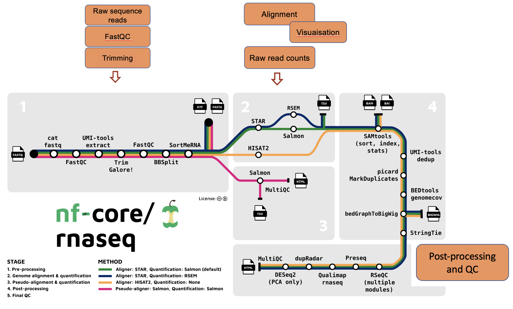

# Recap of Day 1: Raw sequence to counts

### Questions
- How to use nfcore-rnaseq pipeline for differential expression analysis?

  

### Objectives
- Recap Day 1: nfcore-rnaseq pipeline

  

-   What is RNA sequencing and what are the main applications of RNA-seq?
-   What are the typical steps in a RNA-seq differential expression analysis pipeline?
-   Why do we require workflow managers such as nextflow for bioinformatics pipelines?
-   How to run the nfcore-rnaseq pipeline on the Pawsey Nimbus VM?
-   What are the important features of the nfcore-rnaseq pipeline?
-   What to do next; using the gene-count matrix?

#### Notes

1[↩](#a1) Here is a list of ['nfcore pipelines'](https://nf-co.re/pipelines/).

### Key points

- We generated a gene-count matrix using the nfcore-rnaseq pipeline, using a single command.
- The gene-count matrix will be used today for identifying differentially expressed genes.

  