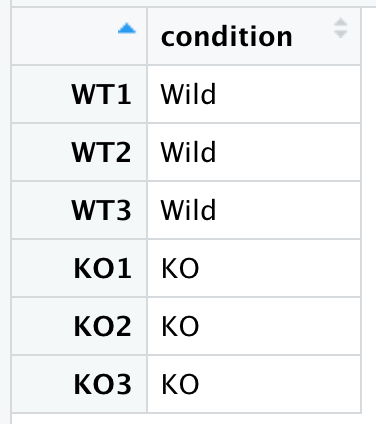
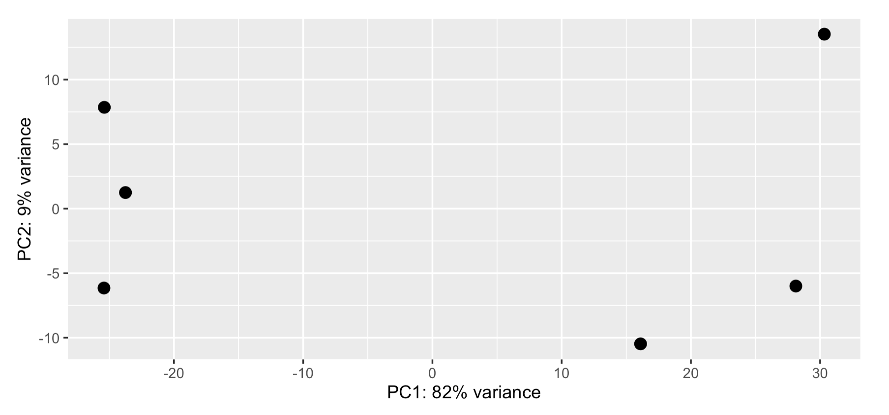

# **Exploratory analysis**

<div class="objectives">  

### **Objectives**

- Perform initial exploratory analysis on the geen-count matrix
</div>  

<div class="questions">

### **Questions**
- How to perform exploratory analysis of the count-matrix?
</div>  


## **Exploratory analysis and visualization**

### **Box plot**
RNA-seq data sometimes contain isolated instances of very large counts that are apparently unrelated to the experimental or study design, and which may be considered outliers. 
<br>A quick look at the distribution of the data across sample using box plots.

```r
boxplot(log2((counttable)+1),las=3, col="red"){width=50%}
```


<br>There are a number of software packages that have been developed for differential expression analysis of RNA-seq data. An extensive comparison of `differential expression analysis of RNA-seq data` can be found in [Soneson and Dleorenzi, 2013](https://bmcbioinformatics.biomedcentral.com/articles/10.1186/1471-2105-14-91).
<br>Today we will be using [DESeq2](https://bioconductor.org/packages/release/bioc/html/DESeq2.html), a popular tool for gene-level differential expression analysis. It uses the negative binomial distribution. 

### **What is a DESeq2 object?**

- The basic entity used by the DESeq2 package is an object class called DESeqDataSet. The DESeqDataSet object is used to store both the read counts and the intermediate estimated quantities during statistical analysis We will call this object by name 'dds' which is a standard practice.
- At minimum, we need to at least have a file which maps our samples to the corresponding sample groups that we are investigating `(a condition variable)`. We will use the columns headers from the counts matrix as the row names of our `metadata` file and have single column to identify each sample as either 'Wild-type (WT)' or 'Knockout (KO)'

```r
# Define a condition variable 
condition=c("WT","WT","WT","KO","KO","KO")
meta <- data.frame(row.names=colnames(counttable),condition)
View(meta)
```
{width=30%} 

- We will now prepare the DESeq2 object with `design = ~1`.
- A design of ~1 is used for no experimental design and is useful for exploring quality of the data (not for identifying differentially expressed -DE genes).


```r
dds <- DESeqDataSetFromMatrix(countData = counttable, 
       colData = meta, 
       design = ~1)
```

### **Normalization**
To perform the median of ratios method of normalization, DESeq2 has a single `estimateSizeFactors()` function that will generate size factors. In a typical RNA-seq analysis, this step is automatically performed by the  `DESeq()` function, which we will discuss later.


### **Data transformations**

- For visualization or clustering it is useful to work with transformed versions of the count data.
- The two most common choices of transformation used for this purpose are -
   - Variance stabilizing transformation (vst)
   - Regularized log transformation (rlog)
- These algorithms transform the raw count data (which is heteroskedatic - variance grows with the mean) into homoskedatic data (variance is not dependant on the mean). 
- Both methods produce data on the log2 scale, and normalize for other factors such as library size. Setting `blind=TRUE` (the default) should be used to compare samples in a manner wholly unbiased about the information about experimental groups, for example to perform sample QC. 


### **Variance stabilisting transformation (VST)**
- VST by default uses a subset of 1000 rows to estimate the dispersion trend. 
- This method is much faster than the other transformation method called - rlog.
- Hence, VST is recommended if you have hundreds of samples.

```r
vst <- vst(dds, blind = TRUE)
vst.data <- assay(vst)

# 
# Regularized log (rlog) takes a long time with 50 or more samples
# rld <- rlog(dds, blind=FALSE)

```


### **Re-drawing the box plots**

- We will now re-generate the box plots to see if the transformation has brought about any difference in distribution.

```r
boxplot(vst.data,las=3, col="red")
```


<div class="challenge">

### **Challenge #1**

Looking at the above two box plots:

- Do you see a difference in the two box plots (before and after transformation)?
- Do you think the transformation has helped?

<details>
<summary>Solution</summary>

This is my solution

</details>
</div>  

### **Principal Component Analysis (PCA)**
- PCA is a linear dimensionality reduction technique. Here dimensions are the features (all your thousands of genes from the genome) which represent the data and explain most of the variability.
- The data points (here, the samples) are projected onto the 2D plane such that they spread out in the two directions that explain most of the differences.
- The percent of the total variance that is contained in the direction is printed in the axis label. **Note** that these percentages do not add to 100%, because there are more dimensions that contain the remaining variance
- Ideally, in your experiment, most of the variability should be explained by the conditions (e.g. WT versus KO in our case-study). If any of the samples group-differently, the DE analysis cannot be relied upon. 
- If we have big number of replicate samples, PCA can assist to identify and remove any outliers.
 

## Plot PCA without condition legend
```r
pcaData <- plotPCA(vst, intgroup=c("condition"), returnData=TRUE)
percentVar <- round(100 * attr(pcaData, "percentVar"))
ggplot(pcaData, aes(PC1, PC2)) +
  geom_point(size=3) +
  xlab(paste0("PC1: ",percentVar[1],"% variance")) +
  ylab(paste0("PC2: ",percentVar[2],"% variance")) + 
  coord_fixed()
```
{width=90%} 

<div class="challenge">

### **Challenge #3**

- Looking at just the PCA, can you guess which samples belong to which conditions?
- Why?

<details>
<summary>Solution</summary>

```r
plotPCA(vst)+ theme(legend.position = "none")
```

 

</details>
</div>  


### **Why choose best the dimension? **  :grinning:

{width=50%} 


  
### **A Scree plot can assist**
- The Principal Component matrix has the same dimensions as the original data matrix; however, many of the PCs may not be informative. A reduction in the number of PCs is typically required. To do so, it is useful to examine the amount of variance explained by each new PC vector using a scree plot/
- The scree plot is used to determine the number of principal components to keep in a principal component analysis (PCA). It shows the eigenvalues on the y-axis and the number of factors on the x-axis and it always displays a downward curve. The point where the slope of the curve is clearly leveling off (the "elbow) indicates the number of factors that should be generated by the analysis.
<br>**Let's draw a scree plot**


```r
pca=prcomp(t(assay(vst)),scale=FALSE)
options(repr.plot.width=0.5, repr.plot.height=0.5)
fviz_eig(pca, addlabels = TRUE)
```


 
  
**We can see that PC1 followed by PC2 have captured most of the variance**

### **Small contributions of many genes to variation**
It is observed that in biological experiments multiple genes contribute to the the principle compoments in a small way. This can be seen in the plot below where the Y-axis shows the small % contributions of multiple genes to PC1

```r
# The function fviz_contrib() [in factoextra package] is used 
# to visualize the contributions of rows/columns from the 
# results of Principal Component Analysis (PCA)
fviz_contrib(pca, choice = "var", axes = 1, top = 100)
```


### **Heatmap (Sample-to-sample distances)**
A heatmap of a distance matrix gives us an overview over similarities and dissimilarities between samples. It helps us assess if this fits to the expectation from the experiment’s design. 

```r
sampleDists <- dist(t(assay(vst)))
sampleDistMatrix <- as.matrix(sampleDists)
rownames(sampleDistMatrix) <- paste(vst$condition, vst$type, sep="-")
colnames(sampleDistMatrix) <- NULL
colors <- colorRampPalette( rev(brewer.pal(9, "Blues")) )(255)
pheatmap(sampleDistMatrix,
         clustering_distance_rows=sampleDists,
         clustering_distance_cols=sampleDists,
         col=colors)
```
 


<div class="challenge">

### **Challenge #2**

Does the heatmap convey information about the samples and the two conditions?


<details>
<summary>Solution</summary>
- The WT samples cluster together.
- One of the KO samples is a bit distant to it's replicates.

</details>
</div>  


<div class="keypoints">
### **Key points**
-   Exploratory analysis with PCA, scree-plots and heatmap for sample-distances can help us get an initial understanding of the data and figure out if the experimental variability is explained by the conditions of interest.
-   It can also help to identify and avoid possible outlier samples from the experiment.
</div>


***NOTE**
Please see the [guide](http://bioconductor.org/packages/release/bioc/vignettes/DESeq2/inst/doc/DESeq2.html) for detailed information about the DESeq2 library
