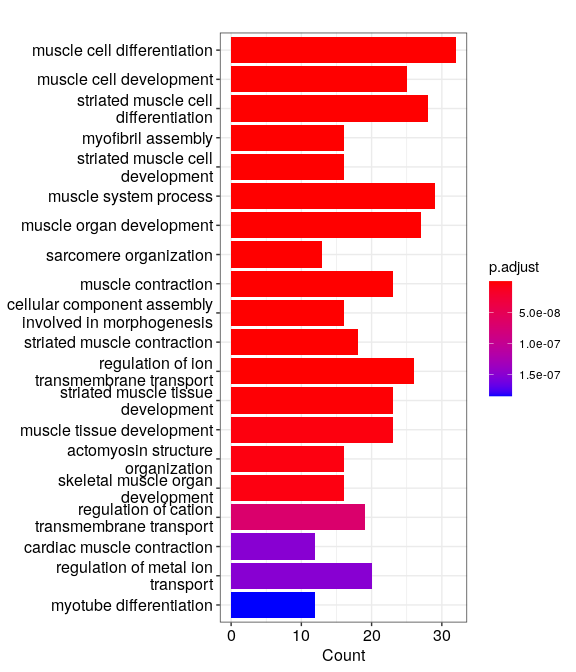
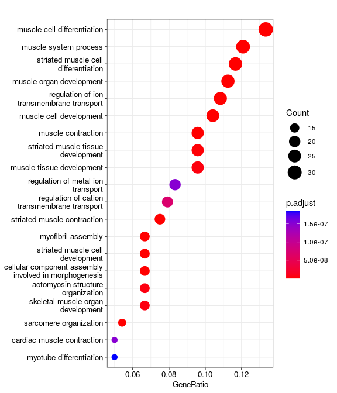
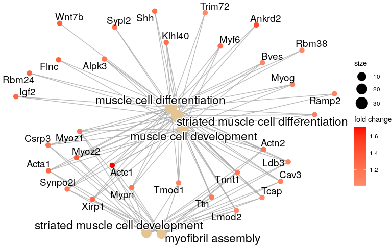
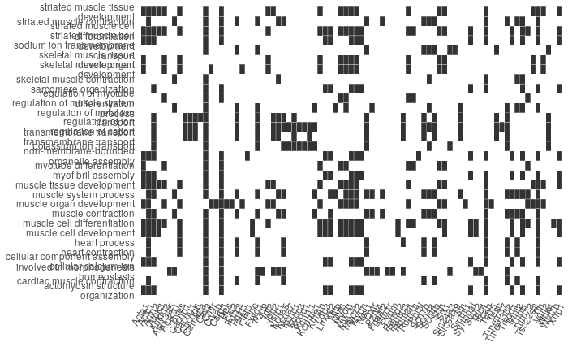
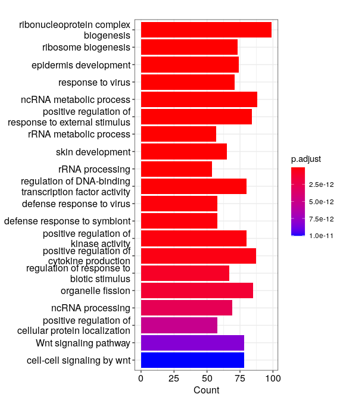
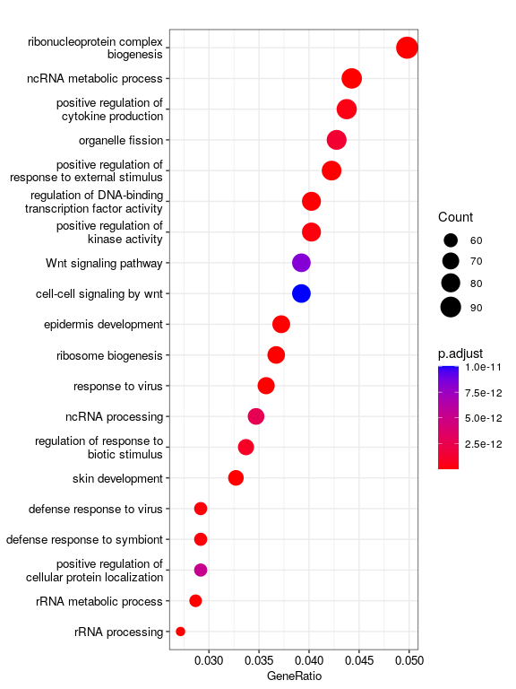
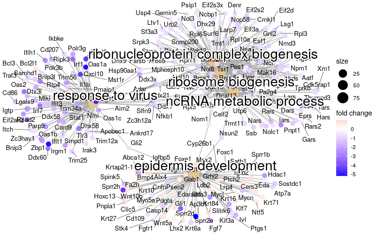
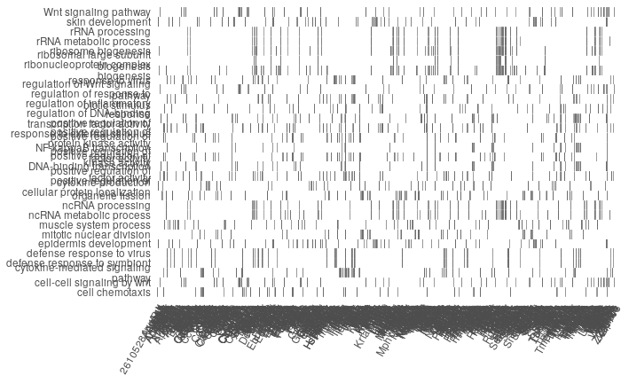

# DE genes to functional enrichment in R

<div class="questions">  
### **Questions**

- How to perform enrichment analysis in R (RStudio)?
- How to visualise functionally enriched Gene ontologies (GO) / pathways as networks?
</div>  

<div class="objectives">  
### **Objectives**

- Perform Functional enrichment analysis of the DE genes in `R`
</div> 


### Gene Ontology (GO) over-representation analysis 
- We will be using the R-package clusterProfiler to perform over-representation analysis on GO terms. 
- The tool takes as input a list of significant genes (DEGs in this case) and a background gene list to perform statistical enrichment analysis using hypergeometric testing.
- The basic arguments allow the user to select the appropriate organism and GO ontology (BP, CC, MF) to test.

#### Prepare input and filter for up and down regulated genes
- Filter by padjust and log fold change. 


```r
# P adj < 0.05 
sig <- res_tidy.DE[res_tidy.DE$p.adjusted < 0.05, ]

# Upregulated: LFC > 1, remove NAs
sig.up <- sig[sig$estimate > 1, ]
sig.up <- na.omit(sig.up)
sig.up.LFC <- sig.up$estimate
names(sig.up.LFC) <- sig.up$gene
# Sort by LFC, decreasing
sig.up.LFC <- sort(sig.up.LFC, decreasing = TRUE)

# Downregulated: LFC < 1, remove NAs
sig.dn <- sig[sig$estimate < 1, ]
sig.dn <- na.omit(sig.dn)
sig.dn.LFC <- sig.dn$estimate
names(sig.dn.LFC) <- sig.dn$gene
# Sort by LFC, decreasing
sig.dn.LFC <- sort(sig.dn.LFC, decreasing = TRUE)
```


### Genes Down-regulated in WT

#### The function enrichGO()
The clusterProfiler package implements enrichGO() for gene ontology over-representation test.

```r
ego.up <- enrichGO(gene = names(sig.up.LFC),
                      OrgDb = org.Mm.eg.db, 
                      keyType = 'SYMBOL',
                      readable = FALSE,
                      ont = "ALL",
                      pAdjustMethod = "BH",
                      pvalueCutoff = 0.05, 
                      qvalueCutoff = 0.2)
```

#### Bar plot
- Bar plot is the most widely used method to visualize enriched terms. 
- It depicts the enrichment scores (e.g. p-values) and gene count or ratio as bar height and color.
```r
barplot(ego.up, showCategory=20)
```

 


#### Dot plot
- A Dot plot is similar to a scatter plot and bar plot with the capability to encode another score as dot size.
- In R the dot plot displays the index (each category) in the vertical axis and the corresponding value in the horizontal axis, so you can see the value of each observation following a horizontal line from the label.
```r
dotplot(ego.up, showCategory=20,font.size = 10)
```


 

#### cnetplot
- Both the barplot and dotplot only displayed most significant enriched terms, while users may want to know which genes are involved in these significant terms. 
- The cnetplot depicts the linkages of genes and biological concepts (e.g. GO terms or KEGG pathways) as a network.
```r
cnetplot(ego.up, 
 categorySize="pvalue", 
 foldChange=sig.up.LFC,
 cex_label_gene = 1,
 showCategory = 5,cex_label_category=1.2,shadowtext='category')
```
 


#### Heatmap-like functional classification
- The heatplot is similar to cnetplot, while displaying the relationships as a heatmap. 
- The gene-concept network may become too complicated if user want to show a large number significant terms. 
- The heatplot can simplify the result and more easy to identify expression patterns.
```r
heatplot(ego.up)
```

 


<div class="challenge">

### Challenge #1

- Do you find any of the top enriched GO categories relavant to the experiment?
- If so what is your deduction? Do you feel RNA-seq experiment has helped ?

<details>
<summary>Solution</summary>

My Solution here

</details>
</div>  


<div class="challenge">

### Challenge #2

- Can you perform similar analysis for genes which are UP-regulated in WT?

<details>
<summary>Solution</summary>

##### Genes Up-regulated in WT

```r
ego.dn <- enrichGO(gene = names(sig.dn.LFC),
OrgDb = org.Mm.eg.db, 
keyType = 'SYMBOL',
readable = FALSE,
ont = "ALL",
pAdjustMethod = "BH",
pvalueCutoff = 0.05, 
qvalueCutoff = 0.2)
```

#### Bar plot
```r
barplot(ego.dn, showCategory=20)
```
 

#### Dot-plot
```r
dotplot(ego.dn, showCategory=20,font.size = 10)
```
 

#### cnetplot
```r
cnetplot(ego.dn, 
 categorySize="pvalue", 
 foldChange=sig.dn.LFC,
 cex_label_gene = 0.7,
 showCategory = 5,cex_label_category=1.5,shadowtext='category')
```
 

#### Heatmap-like functional classification
```r
heatplot(ego.dn)
```
 
</details>
</div>  


<div class="challenge">

### Challenge #3

- What about the GO categories for the genes found UP-regulated in WT? Any interesting find?

<details>
<summary>Solution</summary>

My Solution here

</details>
</div>  


<div class="keypoints">
### **Key points**

- This is a key point
- Another one
</div>